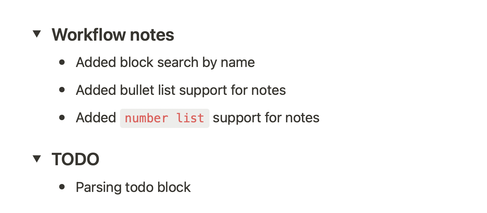

# taskgram
------------

Taskgram создан, чтобы упростить ведение заметок о проделанной и запланированной работе в разных местах.
Например вывод `taskgram` в формате Markdown легко скопировать в [Status Hero](https://statushero.com/).

На данный момент реализована поддержка поиска по [Notion](https://www.notion.so).
`taskgram` ищет в базе данных Notion, которую вы указали к конфиге, все задачи где вы являетесь исполнителем.
Из этого списка задач отбираются те, которые изменялись в указанный период времени и которые имеют у себя на странице блок заголовок (`Heading`), настраиваемый через переменную конфига `search.headingDoneName`, например `Workflow notes`. Внутри блока отбираются заметки в формате блоков `Text`, `Bullet List` и `Numbered List`. Эти заметки будут в выводе после тега `YESTERDAY:`.

Для тега `TODAY:` отбираются все заметки внутри блока загловка `search.headingToDoName` независимо от времени добавления.



Временной интервал можно задавать через конфигурационный файл или аргементы командной строки. Поддерживаемые форматы даты - `m`, `h`, `d` и `w`.
Например `1w3d10h` - это 1 неделя, 3 дня и 10 часов.

## Build
```
make
```

## Run
```
$ taskgram
Finding notes from "Thu, 31 Mar 2022 21:59:34 +04" to "Fri, 01 Apr 2022 21:59:34 +04":

YESTERDAY:
- [Development taskgram](https://www.notion.so/Development-taskgram-970ce9cf59e94fadbbfd2936d6151bb6)
  - Added block search by name
  - Added bullet list support for notes
  - Added number list support for notes

TODAY:
- [Development taskgram](https://www.notion.so/Development-taskgram-970ce9cf59e94fadbbfd2936d6151bb6)
  - Parsing todo block
```

## Config example
`taskgram` searhing config file `.taskgram.yaml` in your home directory.
```yaml
---
notion:
  # You API key.
  apiKey: "secret_XXX..."
  # The Database UUID where you store notes.
  databaseID: "E4C05C5C-67E1-46AB-9BB8-7E9FBAD59A4A"
  # Your Notion's user ID.
  # If not set, will try to get ID from Notion by username.
  userID: "26967411-7DD7-49B5-B9F9-437725C91007"
  # Your preferred name in Notion account.
  username: "John Doe"
  # Timeout for Notion's requests.
  timeout: "10s"
search:
  # Valid time units are "m", "h", "d", "w".
  # Start time when notes was last updated.
  lastEditedTimeStart: "24h"
  # End time when notes was last updated.
  # Empty string is mean now.
  lastEditedTimeEnd: ""
  # Name of heading block where you write done notes.
  headingDoneName: "Workflow notes"
  # Name of heading block where you whire todo notes.
  headingToDoName: "TODO"
```

## Help
```
$ taskgram --help
Usage of ./taskgram:
  -a, --apikey string           You Notion's API key.
  -d, --databaseid string       The Database UUID where you store notes.
  -n, --doneblockkname string   Name of heading block where you write done notes. (default "Workflow notes")
  -e, --endtime string          End time when notes was last updated.
  -s, --starttime string        Start time when notes was last updated. (default "24h")
  -t, --timeout string          Timeout for Notion's requests. (default "10s")
  -b, --todoblockkname string   Name of heading block where you write ToDo notes. (default "TODO")
  -i, --userid string           Your Notion's user ID
  -u, --username string         Your preferred name in Notion account.
```
